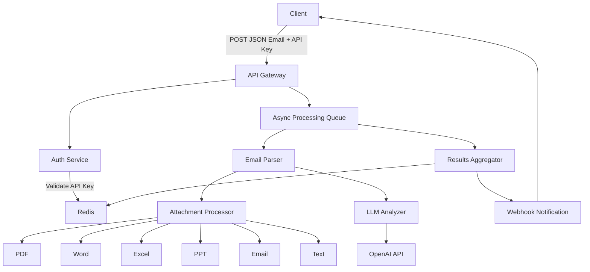

# Mail Analysis API System Overview

## Introduction

The Mail Analysis API is designed to process and analyze email content and attachments at scale. It accepts JSON-formatted email data with attachments, processes them asynchronously, and returns detailed analysis results.

## Architecture Overview

## Key Components

### API Gateway
- FastAPI-based RESTful API
- Handles authentication, rate limiting, and request routing
- Provides synchronous endpoints for job submission and status checking
- Returns immediate response with job ID for asynchronous processing

### Authentication Service
- API key validation against Redis store
- Rate limiting based on client tier (Free, Pro, Enterprise)
- Request throttling when limits are exceeded

### Processing Queue
- Celery-based asynchronous task queue
- Distributes processing load across worker nodes
- Ensures fault tolerance and job persistence

### Email Parser
- Extracts metadata and content from JSON email structure
- Identifies and categorizes email parts (body, headers, attachments)
- Prepares content for LLM analysis

### Attachment Processor
- Specialized handlers for different file types:
  - PDF: Text extraction with PyPDF2/textract
  - Word: Content parsing with python-docx
  - Excel: Data extraction with openpyxl
  - PowerPoint: Slide content extraction with python-pptx
  - Email: Nested email parsing with email module
  - Text: Direct content reading

### LLM Analyzer
- OpenAI GPT integration for natural language processing
- Configurable analysis parameters
- Cost control mechanisms
- Fallback strategies for API failures

### Results Aggregator
- Combines analysis from different components
- Formats final JSON response
- Triggers webhook notifications when processing completes

## System Requirements

- Python 3.9+
- Redis for caching and rate limiting
- RabbitMQ or Redis for Celery queue
- Storage for temporary file processing

## Performance Characteristics

- Handles enterprise-level email volumes
- Configurable rate limits per client tier
- Attachment size limits with validation
- Horizontal scaling capability for worker nodes
