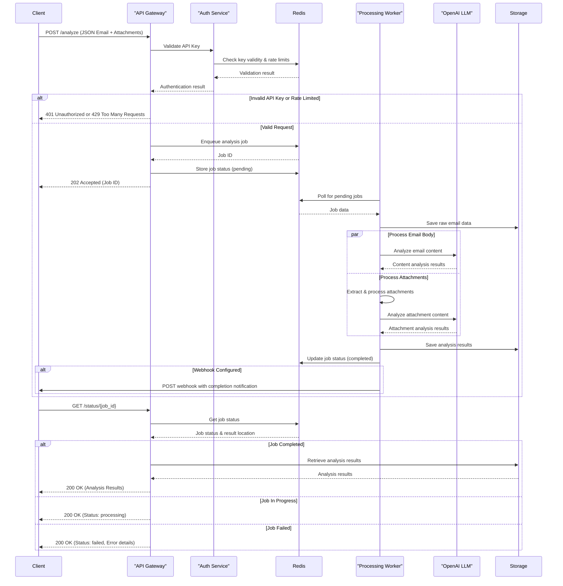
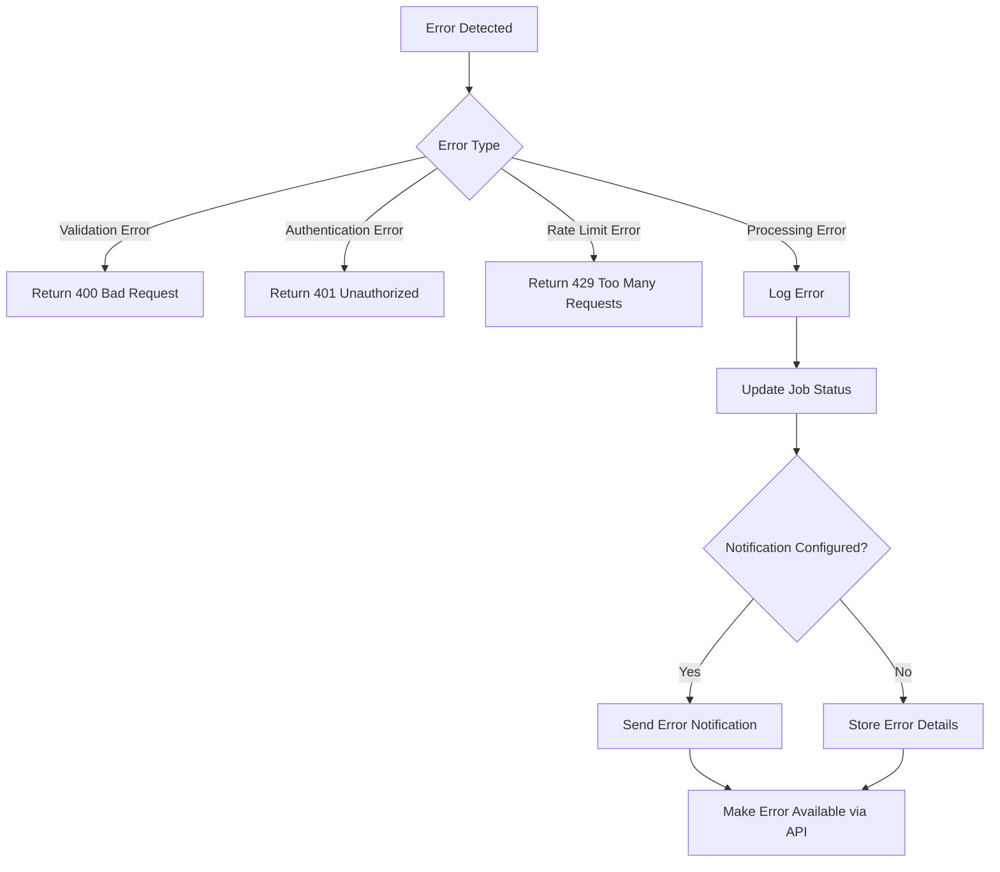

# Mail Analysis API Data Flow

## Request-Response Flow

The Mail Analysis API follows an asynchronous processing model to handle potentially large email datasets and attachments. Below is the detailed data flow from initial request to final response.

## Data Processing Stages

### 1. Request Validation
- Validate API key against Redis store
- Check rate limits for the client tier
- Validate input JSON structure
- Check attachment size and type constraints

### 2. Job Queuing
- Generate unique job ID (UUID)
- Store job metadata in Redis with TTL
- Store job in Redis queue
- Return job ID to client immediately

### 3. Email Content Processing
- Parse email JSON structure
- Extract headers, body, and metadata
- Prepare prompt for LLM analysis
- Send to OpenAI for content analysis
- Process and structure LLM response

### 4. Attachment Processing
- For each attachment:
  1. Identify file type using MIME detection
  2. Route to appropriate file handler
  3. Extract text/data based on file type
  4. Prepare extracted content for analysis
  5. Send to LLM for specialized analysis based on file type

### 5. Results Aggregation
- Combine email body analysis
- Merge attachment analysis results
- Generate summary statistics
- Format final JSON response
- Store complete results in Redis (with TTL) or persistent storage

### 6. Client Notification
- Update job status in Redis
- If webhook URL provided, send completion notification
- Make results available via GET endpoint

## Error Handling Flow

## Data Retention Policy

- Raw email data: 24 hours
- Processing results: 7 days
- Error logs: 30 days
- Job metadata: 7 days

All data retention periods are configurable via the application settings.
