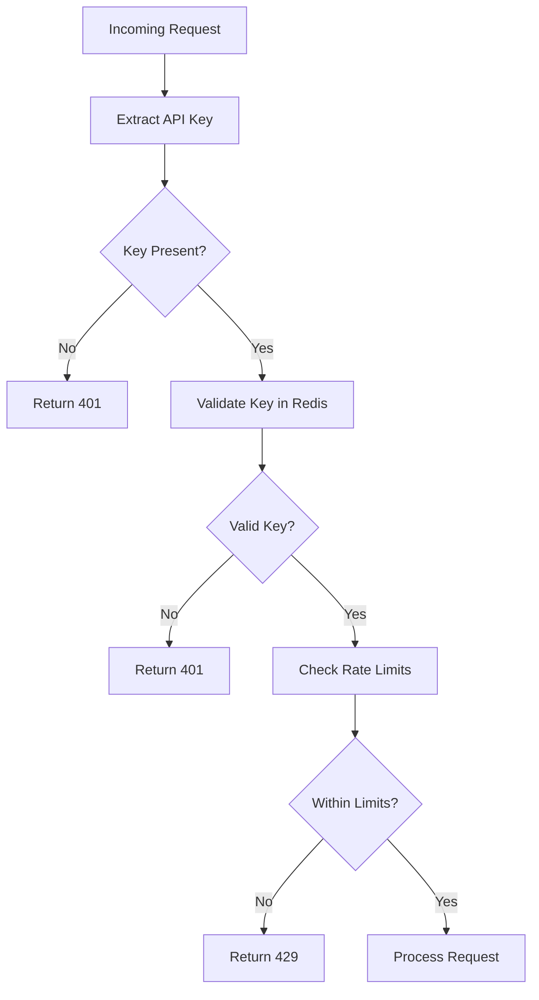
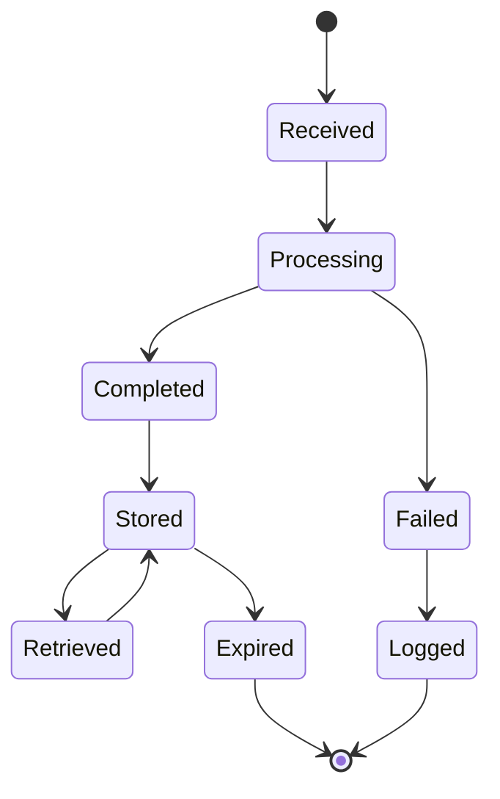

# Mail Analysis API Component Breakdown

This document provides detailed specifications for each component of the Mail Analysis API system.

## API Gateway Components

| Component | Technology | Description | Key Features |
|-----------|------------|-------------|-------------|
| FastAPI Application | FastAPI 0.95+ | Core API framework | Async support, OpenAPI docs, Dependency injection |
| Middleware Layer | Starlette | Request processing pipeline | Authentication, logging, error handling |
| Rate Limiter | Redis + Custom | Request throttling | Tiered limits, sliding window algorithm |
| Request Validator | Pydantic | Input validation | Schema validation, type conversion |
| Response Formatter | FastAPI | Output standardization | Consistent JSON structure |

### API Endpoints

```python
@app.post("/api/v1/analyze", status_code=202)
async def analyze_email(
    email: EmailSchema, 
    background_tasks: BackgroundTasks,
    api_key: str = Header(...)
) -> JobResponse:
    """Submit email for analysis"""
    # Implementation details

@app.get("/api/v1/status/{job_id}")
async def get_job_status(
    job_id: UUID,
    api_key: str = Header(...)
) -> StatusResponse:
    """Check job status"""
    # Implementation details

@app.get("/api/v1/results/{job_id}")
async def get_job_results(
    job_id: UUID,
    api_key: str = Header(...)
) -> AnalysisResponse:
    """Retrieve analysis results"""
    # Implementation details
```

## Authentication Service

| Component | Technology | Description |
|-----------|------------|-------------|
| API Key Validator | Redis | Validates API keys against stored values |
| Rate Limit Enforcer | Redis | Tracks and limits request rates by client |
| Permission Manager | Custom | Manages feature access by subscription tier |

### Authentication Flow



## Task Queue System

| Component | Technology | Description |
|-----------|------------|-------------|
| Task Queue | Celery 5.2+ | Distributed task queue |
| Message Broker | RabbitMQ/Redis | Task message transport |
| Worker Processes | Celery Workers | Task execution |
| Result Backend | Redis | Task result storage |

### Task Definition

```python
@celery_app.task(
    bind=True,
    name="analyze_email_task",
    max_retries=3,
    soft_time_limit=300
)
def analyze_email_task(self, email_data: dict, job_id: str) -> dict:
    """
    Process email analysis job
    
    Args:
        email_data: JSON email data
        job_id: Unique job identifier
        
    Returns:
        Analysis results dictionary
    """
    try:
        # Processing implementation
        return results
    except Exception as exc:
        # Error handling
        self.retry(exc=exc, countdown=exponential_backoff(self.request.retries))
```

## Email Parser

| Component | Technology | Description |
|-----------|------------|-------------|
| JSON Parser | Python stdlib | Parses input JSON |
| Email Extractor | Custom | Extracts email components |
| Metadata Analyzer | Custom | Analyzes email metadata |
| Content Preprocessor | Custom | Prepares text for LLM |

### Email Schema

```python
class EmailAttachment(BaseModel):
    filename: str
    content_type: str
    content: str  # Base64 encoded
    size: int

class EmailAddress(BaseModel):
    name: Optional[str]
    email: EmailStr

class EmailSchema(BaseModel):
    message_id: str
    subject: str
    from_: EmailAddress = Field(..., alias="from")
    to: List[EmailAddress]
    cc: Optional[List[EmailAddress]] = []
    bcc: Optional[List[EmailAddress]] = []
    date: datetime
    body_text: Optional[str] = None
    body_html: Optional[str] = None
    attachments: Optional[List[EmailAttachment]] = []
    headers: Optional[Dict[str, str]] = {}
    
    class Config:
        allow_population_by_field_name = True
```

## Attachment Processor

| File Type | Library | Processing Method |
|-----------|---------|-------------------|
| PDF | PyPDF2/textract | Text extraction, metadata analysis |
| Word | python-docx | Document parsing, style analysis |
| Excel | openpyxl | Sheet data extraction, formula analysis |
| PowerPoint | python-pptx | Slide content extraction |
| Email | email/mailparser | Nested email parsing |
| Text | Python stdlib | Direct text processing |

### File Type Detection

```python
def detect_file_type(content: bytes, filename: str) -> str:
    """
    Detect file MIME type from content and filename
    
    Args:
        content: File content as bytes
        filename: Original filename
        
    Returns:
        MIME type string
    """
    # Implementation using python-magic or mimetypes
```

## LLM Analyzer

| Component | Technology | Description |
|-----------|------------|-------------|
| OpenAI Client | openai-python | API communication |
| Prompt Manager | Custom | Manages analysis prompts |
| Response Parser | Custom | Parses and structures LLM responses |
| Cost Tracker | Redis | Tracks token usage and costs |

### Analysis Types

| Analysis Type | Description | Example Prompt |
|---------------|-------------|---------------|
| Sentiment Analysis | Detects emotional tone | "Analyze the sentiment of this email..." |
| Topic Extraction | Identifies main topics | "Extract the key topics from this email..." |
| Action Item Detection | Finds requested actions | "Identify any action items or requests..." |
| Intent Classification | Determines email purpose | "Classify the intent of this email..." |
| Summary Generation | Creates concise summary | "Summarize this email in 3 sentences..." |

## Results Aggregator

| Component | Technology | Description |
|-----------|------------|-------------|
| Result Collector | Custom | Collects analysis results |
| JSON Formatter | Python stdlib | Formats final JSON response |
| Webhook Notifier | httpx | Sends webhook notifications |
| Storage Manager | Redis/S3 | Manages result storage |

### Result Schema

```python
class AttachmentAnalysis(BaseModel):
    filename: str
    content_type: str
    size: int
    content_summary: str
    sentiment: Optional[str] = None
    topics: List[str] = []
    entities: List[Dict[str, str]] = []
    
class EmailAnalysis(BaseModel):
    message_id: str
    subject: str
    date: datetime
    summary: str
    sentiment: str
    topics: List[str]
    action_items: List[str]
    entities: List[Dict[str, str]]
    intent: str
    importance_score: float
    attachment_analyses: List[AttachmentAnalysis] = []
    processing_time: float
    job_id: UUID
```

## Storage System

| Component | Technology | Description |
|-----------|------------|-------------|
| Temporary Storage | Redis | Short-term data caching |
| Result Storage | Redis/S3 | Analysis result storage |
| Log Storage | File system | Error and audit logging |

### Data Lifecycle



## Monitoring & Logging

| Component | Technology | Description |
|-----------|------------|-------------|
| Application Logs | Loguru | Structured application logging |
| Error Tracking | Custom | Error aggregation and notification |
| Performance Metrics | Prometheus | System performance monitoring |
| Health Checks | FastAPI | Endpoint health monitoring |

### Log Format

```json
{
  "timestamp": "2023-04-02T15:30:45.123Z",
  "level": "INFO",
  "message": "Email analysis completed",
  "job_id": "550e8400-e29b-41d4-a716-446655440000",
  "processing_time_ms": 1234,
  "component": "worker",
  "email_size_bytes": 25600,
  "attachment_count": 2
}
