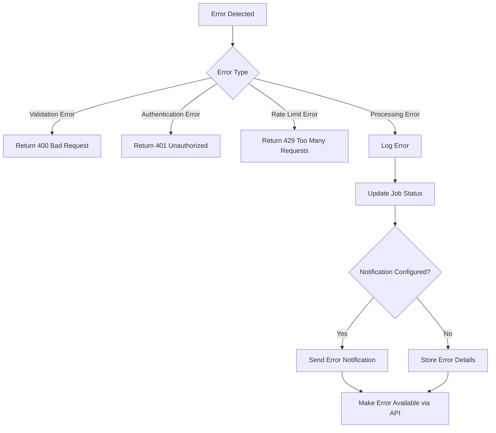
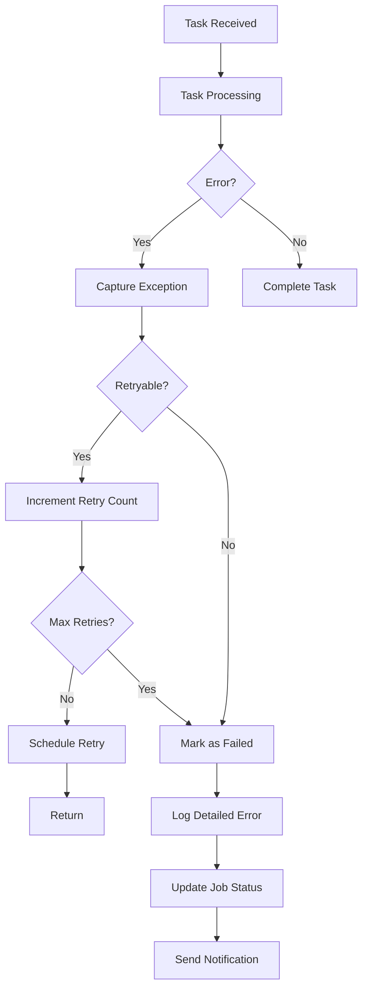

# Mail Analysis API Error Handling & Notifications

This document outlines the error handling strategy and notification mechanisms for the Mail Analysis API.

## Error Classification

Errors in the Mail Analysis API are classified into the following categories:

| Error Category | HTTP Status | Description | Example |
|----------------|-------------|-------------|---------|
| Authentication Errors | 401 | API key validation failures | Invalid or expired API key |
| Authorization Errors | 403 | Permission-related failures | Attempting to access premium features with basic tier |
| Validation Errors | 400 | Input data validation failures | Malformed JSON, missing required fields |
| Rate Limit Errors | 429 | Request throttling | Exceeding tier-based rate limits |
| Resource Errors | 404 | Resource not found | Job ID not found |
| Processing Errors | 500 | Internal processing failures | File parsing errors, LLM API failures |
| Configuration Errors | 500 | System configuration issues | Missing environment variables |
| External Service Errors | 502 | Third-party service failures | OpenAI API unavailable |

## Error Response Format

All API errors follow a consistent JSON response format:

```json
{
  "error": {
    "code": "rate_limit_exceeded",
    "message": "You have exceeded your rate limit of 100 requests per minute",
    "details": {
      "limit": 100,
      "period": "minute",
      "reset_at": "2023-04-02T15:45:00Z"
    },
    "request_id": "550e8400-e29b-41d4-a716-446655440000"
  }
}
```

## Error Handling Strategy

### API Gateway Layer



### Worker Layer



## Logging Strategy

The Mail Analysis API uses a structured logging approach with the following levels:

| Log Level | Usage |
|-----------|-------|
| DEBUG | Detailed debugging information |
| INFO | General operational information |
| WARNING | Warning events that might cause issues |
| ERROR | Error events that might still allow the application to continue |
| CRITICAL | Critical events that may cause the application to terminate |

### Log Format

```python
logger.error(
    "Failed to process attachment",
    extra={
        "job_id": job_id,
        "attachment_name": attachment.filename,
        "attachment_type": attachment.content_type,
        "error_type": str(type(e).__name__),
        "error_message": str(e),
        "traceback": traceback.format_exc()
    }
)
```

## Notification System

### Email Notifications

The system can send email notifications for critical errors to configured recipients:

```python
async def send_error_email(error_details: dict):
    """
    Send error notification email
    
    Args:
        error_details: Dictionary with error information
    """
    if not config.notifications.email.enabled:
        return
        
    subject = f"[ALERT] Mail Analysis API Error: {error_details['error_type']}"
    
    body = f"""
    Error detected in Mail Analysis API:
    
    Time: {error_details['timestamp']}
    Component: {error_details['component']}
    Error Type: {error_details['error_type']}
    Error Message: {error_details['error_message']}
    Job ID: {error_details.get('job_id', 'N/A')}
    
    Additional Context:
    {json.dumps(error_details.get('context', {}), indent=2)}
    
    Traceback:
    {error_details.get('traceback', 'Not available')}
    """
    
    # Email sending implementation
```

### Webhook Notifications

Clients can register a webhook URL to receive error notifications:

```python
async def send_webhook_notification(
    webhook_url: str,
    event_type: str,
    payload: dict
):
    """
    Send webhook notification
    
    Args:
        webhook_url: Client's webhook URL
        event_type: Event type (e.g., 'job.completed', 'job.failed')
        payload: Event payload
    """
    notification = {
        "event": event_type,
        "timestamp": datetime.utcnow().isoformat() + "Z",
        "data": payload
    }
    
    async with httpx.AsyncClient() as client:
        try:
            response = await client.post(
                webhook_url,
                json=notification,
                timeout=5.0
            )
            return response.status_code == 200
        except Exception as e:
            logger.error(f"Webhook notification failed: {str(e)}")
            return False
```

## Error Recovery Mechanisms

### Exponential Backoff for Retries

```python
def exponential_backoff(retry_count: int) -> int:
    """
    Calculate exponential backoff time in seconds
    
    Args:
        retry_count: Current retry attempt (0-based)
        
    Returns:
        Delay in seconds before next retry
    """
    return min(2 ** retry_count + random.uniform(0, 1), 60)
```

### Circuit Breaker for External Services

```python
class CircuitBreaker:
    def __init__(
        self,
        failure_threshold: int = 5,
        recovery_timeout: int = 30,
        timeout: float = 10.0
    ):
        self.failure_count = 0
        self.failure_threshold = failure_threshold
        self.recovery_timeout = recovery_timeout
        self.timeout = timeout
        self.last_failure_time = 0
        self.state = "CLOSED"  # CLOSED, OPEN, HALF-OPEN
        
    async def call(self, func, *args, **kwargs):
        """Execute function with circuit breaker protection"""
        if self.state == "OPEN":
            if time.time() - self.last_failure_time > self.recovery_timeout:
                self.state = "HALF-OPEN"
            else:
                raise CircuitBreakerOpenError("Circuit breaker is open")
                
        try:
            result = await asyncio.wait_for(
                func(*args, **kwargs),
                timeout=self.timeout
            )
            
            if self.state == "HALF-OPEN":
                self.failure_count = 0
                self.state = "CLOSED"
                
            return result
            
        except Exception as e:
            self.failure_count += 1
            self.last_failure_time = time.time()
            
            if self.failure_count >= self.failure_threshold:
                self.state = "OPEN"
                
            raise e
```

## Monitoring and Alerting

### Health Check Endpoints

```python
@app.get("/health")
async def health_check():
    """Basic health check endpoint"""
    return {"status": "ok"}

@app.get("/health/detailed")
async def detailed_health_check(
    api_key: str = Header(...),
    redis: Redis = Depends(get_redis_client),
    celery: Celery = Depends(get_celery_app)
):
    """Detailed health check with component status"""
    # Check API key for admin permissions
    if not is_admin_key(api_key, redis):
        raise HTTPException(status_code=403, detail="Admin API key required")
        
    # Check Redis connection
    try:
        await redis.ping()
        redis_status = "ok"
    except Exception as e:
        redis_status = f"error: {str(e)}"
        
    # Check Celery/RabbitMQ connection
    try:
        celery_status = celery.control.inspect().ping() is not None
    except Exception as e:
        celery_status = f"error: {str(e)}"
        
    # Check OpenAI API
    try:
        openai_status = await check_openai_api()
    except Exception as e:
        openai_status = f"error: {str(e)}"
        
    return {
        "status": "ok" if all(s == "ok" for s in [redis_status, celery_status, openai_status]) else "degraded",
        "components": {
            "api": "ok",
            "redis": redis_status,
            "task_queue": celery_status,
            "openai": openai_status
        },
        "timestamp": datetime.utcnow().isoformat() + "Z"
    }
```

### Error Rate Monitoring

```python
@app.middleware("http")
async def error_rate_monitoring(request: Request, call_next):
    """Monitor error rates and trigger alerts if threshold exceeded"""
    try:
        response = await call_next(request)
        
        if response.status_code >= 500:
            await increment_error_counter(request.url.path)
            
        return response
    except Exception as e:
        await increment_error_counter(request.url.path)
        raise e
        
async def increment_error_counter(path: str):
    """Increment error counter for endpoint and check threshold"""
    redis = get_redis_client()
    key = f"error_count:{path}:{int(time.time() / 60)}"
    
    count = await redis.incr(key)
    await redis.expire(key, 300)  # Keep for 5 minutes
    
    if count >= config.alerts.error_threshold:
        await trigger_error_rate_alert(path, count)
