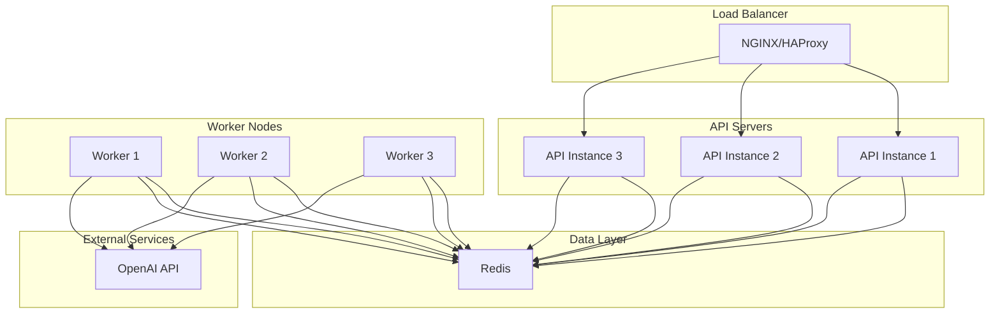

# Mail Analysis API Deployment Guide

This document outlines the deployment architecture and procedures for the Mail Analysis API.

## Deployment Architecture



## System Requirements

### API Server Requirements

| Resource | Minimum | Recommended |
|----------|---------|-------------|
| CPU | 2 cores | 4 cores |
| RAM | 4 GB | 8 GB |
| Disk | 20 GB SSD | 40 GB SSD |
| Network | 100 Mbps | 1 Gbps |

### Worker Node Requirements

| Resource | Minimum | Recommended |
|----------|---------|-------------|
| CPU | 4 cores | 8 cores |
| RAM | 8 GB | 16 GB |
| Disk | 40 GB SSD | 100 GB SSD |
| Network | 100 Mbps | 1 Gbps |

### Redis Requirements

| Resource | Minimum | Recommended |
|----------|---------|-------------|
| CPU | 2 cores | 4 cores |
| RAM | 4 GB | 8 GB |
| Disk | 20 GB SSD | 40 GB SSD |
| Network | 100 Mbps | 1 Gbps |


## Deployment Options

### Docker Compose (Development/Testing)

```yaml
# docker-compose.yml
version: '3.8'

services:
  api:
    build:
      context: .
      dockerfile: Dockerfile.api
    ports:
      - "8000:8000"
    environment:
      - REDIS_HOST=redis
      - OPENAI_API_KEY=${OPENAI_API_KEY}
    depends_on:
      - redis
    volumes:
      - ./config:/app/config
    restart: unless-stopped

  worker:
    build:
      context: .
      dockerfile: Dockerfile.worker
    environment:
      - REDIS_HOST=redis
      - OPENAI_API_KEY=${OPENAI_API_KEY}
    depends_on:
      - redis
    volumes:
      - ./config:/app/config
    restart: unless-stopped

  redis:
    image: redis:7-alpine
    ports:
      - "6379:6379"
    volumes:
      - redis-data:/data
    restart: unless-stopped

volumes:
  redis-data:
```

### Kubernetes (Production)

```yaml
# kubernetes/api-deployment.yaml
apiVersion: apps/v1
kind: Deployment
metadata:
  name: mail-analysis-api
  labels:
    app: mail-analysis-api
spec:
  replicas: 3
  selector:
    matchLabels:
      app: mail-analysis-api
  template:
    metadata:
      labels:
        app: mail-analysis-api
    spec:
      containers:
      - name: api
        image: mail-analysis-api:latest
        ports:
        - containerPort: 8000
        env:
        - name: REDIS_HOST
          value: redis-service
        - name: OPENAI_API_KEY
          valueFrom:
            secretKeyRef:
              name: api-secrets
              key: openai-api-key
        resources:
          requests:
            cpu: "500m"
            memory: "1Gi"
          limits:
            cpu: "2"
            memory: "4Gi"
        livenessProbe:
          httpGet:
            path: /health
            port: 8000
          initialDelaySeconds: 30
          periodSeconds: 10
        readinessProbe:
          httpGet:
            path: /health
            port: 8000
          initialDelaySeconds: 5
          periodSeconds: 5
        volumeMounts:
        - name: config-volume
          mountPath: /app/config
      volumes:
      - name: config-volume
        configMap:
          name: mail-analysis-config
```

```yaml
# kubernetes/worker-deployment.yaml
apiVersion: apps/v1
kind: Deployment
metadata:
  name: mail-analysis-worker
  labels:
    app: mail-analysis-worker
spec:
  replicas: 5
  selector:
    matchLabels:
      app: mail-analysis-worker
  template:
    metadata:
      labels:
        app: mail-analysis-worker
    spec:
      containers:
      - name: worker
        image: mail-analysis-worker:latest
        env:
        - name: REDIS_HOST
          value: redis-service
        - name: OPENAI_API_KEY
          valueFrom:
            secretKeyRef:
              name: api-secrets
              key: openai-api-key
        resources:
          requests:
            cpu: "1"
            memory: "2Gi"
          limits:
            cpu: "4"
            memory: "8Gi"
        volumeMounts:
        - name: config-volume
          mountPath: /app/config
        - name: temp-storage
          mountPath: /app/temp
      volumes:
      - name: config-volume
        configMap:
          name: mail-analysis-config
      - name: temp-storage
        emptyDir: {}
```

## Configuration Management

### Environment Variables

| Variable | Description | Default | Required |
|----------|-------------|---------|----------|
| REDIS_HOST | Redis server hostname | localhost | Yes |
| REDIS_PORT | Redis server port | 6379 | No |
| REDIS_PASSWORD | Redis server password | None | No |
| OPENAI_API_KEY | OpenAI API key | None | Yes |
| LOG_LEVEL | Application log level | INFO | No |
| CONFIG_PATH | Path to configuration file | config/settings.yaml | No |

### Configuration File

The application uses a YAML configuration file for settings that don't change between environments:

```yaml
# config/settings.yaml
app:
  env: "production"
  max_attachment_size: 25MB
  allowed_file_types:
    extensions: [".pdf", ".docx", ".xlsx", ".pptx", ".eml", ".txt"]
    mime_types: 
      - "application/pdf"
      - "application/vnd.openxmlformats-officedocument.*"
      - "text/plain"
      - "message/rfc822"

rate_limits:
  tiers:
    free:
      requests_per_minute: 10
      max_concurrent: 2
    pro:
      requests_per_minute: 100
      max_concurrent: 20
    enterprise:
      requests_per_minute: 1000
      max_concurrent: 100

openai:
  max_tokens_per_request: 4096
  monthly_cost_limit: 1000
  model_choices:
    - "gpt-4-1106-preview"
    - "gpt-3.5-turbo-1106"
  fallback_model: "gpt-3.5-turbo-1106"

notifications:
  email:
    enabled: false
    smtp_server: "smtp.example.com"
    smtp_port: 587
    sender: "noreply@mailanalyzer.com"
    recipients: ["devops@company.com"]
  log_file:
    path: "logs/errors.log"
    max_size: 100MB
    backup_count: 5
```

## Deployment Procedure

### Docker Deployment

1. Clone the repository:
   ```bash
   git clone https://github.com/company/mail-analysis-api.git
   cd mail-analysis-api
   ```

2. Create a `.env` file with required environment variables:
   ```
   OPENAI_API_KEY=your_openai_api_key
   ```

3. Build and start the services:
   ```bash
   docker-compose up -d
   ```

4. Verify the deployment:
   ```bash
   curl http://localhost:8000/health
   ```

### Kubernetes Deployment

1. Create the necessary Kubernetes resources:
   ```bash
   # Create namespace
   kubectl create namespace mail-analysis
   
   # Create ConfigMap for configuration
   kubectl create configmap mail-analysis-config --from-file=config/settings.yaml -n mail-analysis
   
   # Create Secret for API keys
   kubectl create secret generic api-secrets \
     --from-literal=openai-api-key=your_openai_api_key \
     -n mail-analysis
   
   # Apply deployments
   kubectl apply -f kubernetes/redis-deployment.yaml -n mail-analysis
   kubectl apply -f kubernetes/api-deployment.yaml -n mail-analysis
   kubectl apply -f kubernetes/worker-deployment.yaml -n mail-analysis
   
   # Apply services
   kubectl apply -f kubernetes/redis-service.yaml -n mail-analysis
   kubectl apply -f kubernetes/api-service.yaml -n mail-analysis
   ```

2. Verify the deployment:
   ```bash
   kubectl get pods -n mail-analysis
   kubectl get services -n mail-analysis
   ```

## Scaling Considerations

### Horizontal Scaling

- **API Servers**: Scale based on request rate and CPU utilization
- **Worker Nodes**: Scale based on queue depth and processing time
- **Redis**: Consider Redis Cluster for high availability and sharding

### Vertical Scaling

- Increase CPU and memory for worker nodes if processing large attachments
- Increase Redis memory if caching large volumes of results

### Auto-scaling Configuration (Kubernetes)

```yaml
# kubernetes/api-hpa.yaml
apiVersion: autoscaling/v2
kind: HorizontalPodAutoscaler
metadata:
  name: mail-analysis-api-hpa
spec:
  scaleTargetRef:
    apiVersion: apps/v1
    kind: Deployment
    name: mail-analysis-api
  minReplicas: 3
  maxReplicas: 10
  metrics:
  - type: Resource
    resource:
      name: cpu
      target:
        type: Utilization
        averageUtilization: 70
```

```yaml
# kubernetes/worker-hpa.yaml
apiVersion: autoscaling/v2
kind: HorizontalPodAutoscaler
metadata:
  name: mail-analysis-worker-hpa
spec:
  scaleTargetRef:
    apiVersion: apps/v1
    kind: Deployment
    name: mail-analysis-worker
  minReplicas: 5
  maxReplicas: 20
  metrics:
  - type: Resource
    resource:
      name: cpu
      target:
        type: Utilization
        averageUtilization: 70
```

## API Documentation

The API provides automatic interactive documentation:

1. **Swagger UI**: Accessible at `/api/docs`
   - Interactive documentation
   - Try out endpoints directly
   - Available in development and production

2. **ReDoc**: Accessible at `/api/redoc`
   - Alternative documentation viewer
   - More readable format for API reference

3. **OpenAPI Schema**: Available at `/api/openapi.json`
   - Machine-readable API specification
   - Can be imported into API testing tools

Example URLs when running locally:
- http://localhost:8000/api/docs
- http://localhost:8000/api/redoc

## Monitoring Setup

### Prometheus Configuration

```yaml
# prometheus/prometheus.yml
scrape_configs:
  - job_name: 'mail-analysis-api'
    scrape_interval: 15s
    metrics_path: /metrics
    static_configs:
      - targets: ['mail-analysis-api:8000']
```

### Grafana Dashboard

Key metrics to monitor:
- Request rate and latency
- Queue depth and processing time
- Error rates by category
- Resource utilization (CPU, memory)
- OpenAI API usage and costs

## Backup and Disaster Recovery

### Redis Backup

```bash
# Automated Redis backup script
#!/bin/bash
TIMESTAMP=$(date +%Y%m%d%H%M%S)
BACKUP_DIR="/backups/redis"
redis-cli SAVE
cp /var/lib/redis/dump.rdb $BACKUP_DIR/redis-$TIMESTAMP.rdb
find $BACKUP_DIR -name "redis-*.rdb" -mtime +7 -delete
```


## Security Considerations

### Network Security

- Use TLS for all external communication
- Implement network policies to restrict pod-to-pod communication
- Use private networks for internal services

### API Security

- Implement API key rotation policies
- Use rate limiting to prevent abuse
- Validate and sanitize all input

### Data Security

- Encrypt sensitive data at rest
- Implement proper data retention policies
- Ensure secure handling of email content

## Maintenance Procedures

### Rolling Updates

```bash
# Update API servers
kubectl set image deployment/mail-analysis-api api=mail-analysis-api:new-version -n mail-analysis

# Update worker nodes
kubectl set image deployment/mail-analysis-worker worker=mail-analysis-worker:new-version -n mail-analysis
```

### Database Maintenance

```bash
# Redis maintenance
redis-cli BGREWRITEAOF
redis-cli --stat  # Monitor Redis statistics

```

### Log Rotation

```
# logrotate configuration
/var/log/mail-analysis/*.log {
    daily
    missingok
    rotate 14
    compress
    delaycompress
    notifempty
    create 0640 mail-analysis mail-analysis
    sharedscripts
    postrotate
        systemctl reload mail-analysis-api
    endscript
}
