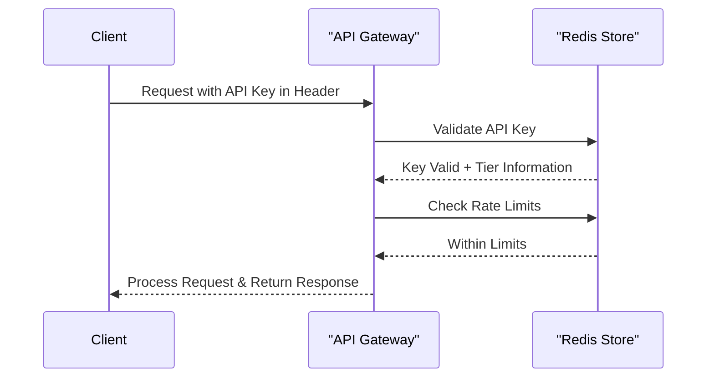

# Mail Analysis API Security Architecture

This document outlines the security architecture and authentication mechanisms for the Mail Analysis API.

## Authentication Model

The Mail Analysis API uses API key-based authentication for all requests. This approach was chosen for its simplicity, ease of implementation, and suitability for server-to-server communication.



## API Key Management

### API Key Structure

API keys follow this structure:

```
ma_[tier]_[random string]
```

Example:
```
ma_pro_8f7d9a6e2b1c5f3a7d8e9f1a2b3c4d5e
```

Where:
- `ma_` is a fixed prefix identifying our service
- `[tier]` indicates the subscription level (free, pro, enterprise)
- `[random string]` is a cryptographically secure random string

### API Key Storage

API keys are stored in Redis with the following structure:

```
Key: api_keys:{api_key}
Value: {
  "client_id": "client123",
  "tier": "pro",
  "created_at": "2023-04-02T12:00:00Z",
  "expires_at": "2024-04-02T12:00:00Z",
  "rate_limit_override": null,
  "permissions": ["analyze", "status", "results"]
}
```

### API Key Generation

```python
def generate_api_key(client_id: str, tier: str) -> str:
    """
    Generate a new API key
    
    Args:
        client_id: Unique client identifier
        tier: Subscription tier (free, pro, enterprise)
        
    Returns:
        Newly generated API key
    """
    random_part = secrets.token_hex(16)
    api_key = f"ma_{tier}_{random_part}"
    
    # Store in Redis with 1-year expiration
    expiration = datetime.utcnow() + timedelta(days=365)
    
    redis_client.setex(
        f"api_keys:{api_key}",
        60 * 60 * 24 * 365,  # 1 year in seconds
        json.dumps({
            "client_id": client_id,
            "tier": tier,
            "created_at": datetime.utcnow().isoformat() + "Z",
            "expires_at": expiration.isoformat() + "Z",
            "rate_limit_override": None,
            "permissions": get_tier_permissions(tier)
        })
    )
    
    return api_key
```

### API Key Validation

```python
async def validate_api_key(api_key: str) -> dict:
    """
    Validate an API key
    
    Args:
        api_key: API key to validate
        
    Returns:
        API key metadata if valid
        
    Raises:
        HTTPException: If API key is invalid or expired
    """
    key_data = await redis_client.get(f"api_keys:{api_key}")
    
    if not key_data:
        raise HTTPException(
            status_code=401,
            detail="Invalid API key"
        )
        
    key_info = json.loads(key_data)
    
    # Check if key has expired
    if datetime.fromisoformat(key_info["expires_at"].rstrip("Z")) < datetime.utcnow():
        raise HTTPException(
            status_code=401,
            detail="Expired API key"
        )
        
    return key_info
```

## Rate Limiting

### Rate Limit Configuration

Rate limits are configured per subscription tier:

```yaml
rate_limits:
  tiers:
    free:
      requests_per_minute: 10
      max_concurrent: 2
    pro:
      requests_per_minute: 100
      max_concurrent: 20
    enterprise:
      requests_per_minute: 1000
      max_concurrent: 100
```

### Rate Limit Implementation

The API uses a sliding window algorithm implemented in Redis:

```python
async def check_rate_limit(api_key: str, key_info: dict) -> bool:
    """
    Check if request is within rate limits
    
    Args:
        api_key: API key
        key_info: API key metadata
        
    Returns:
        True if within limits, False otherwise
    """
    tier = key_info["tier"]
    client_id = key_info["client_id"]
    
    # Get rate limit for tier
    rate_limit = key_info.get("rate_limit_override") or config.rate_limits.tiers[tier].requests_per_minute
    
    # Current timestamp
    now = int(time.time())
    window_start = now - 60  # 1 minute window
    
    # Redis key for rate limiting
    rate_key = f"rate_limit:{client_id}:{now // 60}"
    
    # Add current timestamp to sorted set with sliding window
    pipeline = redis_client.pipeline()
    pipeline.zadd(rate_key, {str(now): now})
    pipeline.zremrangebyscore(rate_key, 0, window_start)
    pipeline.zcard(rate_key)
    pipeline.expire(rate_key, 120)  # Keep for 2 minutes
    
    _, _, request_count, _ = await pipeline.execute()
    
    return request_count <= rate_limit
```

### Rate Limit Headers

The API includes rate limit information in response headers:

```python
@app.middleware("http")
async def rate_limit_middleware(request: Request, call_next):
    """Add rate limit headers to responses"""
    # Process request normally
    response = await call_next(request)
    
    # Get API key from request
    api_key = request.headers.get("X-API-Key")
    
    if api_key:
        try:
            key_info = await validate_api_key(api_key)
            tier = key_info["tier"]
            client_id = key_info["client_id"]
            
            # Get rate limit info
            rate_limit = key_info.get("rate_limit_override") or config.rate_limits.tiers[tier].requests_per_minute
            
            # Get current usage
            now = int(time.time())
            rate_key = f"rate_limit:{client_id}:{now // 60}"
            request_count = await redis_client.zcard(rate_key)
            
            # Add headers
            response.headers["X-RateLimit-Limit"] = str(rate_limit)
            response.headers["X-RateLimit-Remaining"] = str(max(0, rate_limit - request_count))
            response.headers["X-RateLimit-Reset"] = str((now // 60 + 1) * 60)
        except Exception:
            # Ignore errors in rate limit header generation
            pass
    
    return response
```

## Permission Model

### Tier-Based Permissions

Each subscription tier has associated permissions:

```python
def get_tier_permissions(tier: str) -> List[str]:
    """
    Get permissions for a subscription tier
    
    Args:
        tier: Subscription tier
        
    Returns:
        List of permission strings
    """
    base_permissions = ["analyze", "status", "results"]
    
    if tier == "free":
        return base_permissions
    elif tier == "pro":
        return base_permissions + ["webhook", "priority"]
    elif tier == "enterprise":
        return base_permissions + ["webhook", "priority", "custom_models", "batch"]
    else:
        return []
```

### Permission Checking

```python
def requires_permission(permission: str):
    """
    Dependency for requiring a specific permission
    
    Args:
        permission: Required permission string
    """
    async def check_permission(
        api_key: str = Header(..., alias="X-API-Key")
    ):
        key_info = await validate_api_key(api_key)
        
        if permission not in key_info["permissions"]:
            raise HTTPException(
                status_code=403,
                detail=f"This operation requires the '{permission}' permission"
            )
        
        return key_info
    
    return check_permission
```

## Input Validation

### Request Validation

All API requests are validated using Pydantic models:

```python
class EmailAttachment(BaseModel):
    filename: str
    content_type: str
    content: str  # Base64 encoded
    size: int
    
    @validator("size")
    def validate_size(cls, v):
        max_size = config.app.max_attachment_size
        if v > max_size:
            raise ValueError(f"Attachment size exceeds maximum of {max_size} bytes")
        return v
    
    @validator("content")
    def validate_content(cls, v):
        try:
            # Attempt to decode base64
            base64.b64decode(v)
            return v
        except Exception:
            raise ValueError("Invalid base64 encoding for attachment content")
```

### Content Security

```python
def sanitize_html(html_content: str) -> str:
    """
    Sanitize HTML content to prevent XSS
    
    Args:
        html_content: Raw HTML content
        
    Returns:
        Sanitized HTML content
    """
    # Use a library like bleach to sanitize HTML
    return bleach.clean(
        html_content,
        tags=bleach.sanitizer.ALLOWED_TAGS,
        attributes=bleach.sanitizer.ALLOWED_ATTRIBUTES,
        styles=bleach.sanitizer.ALLOWED_STYLES,
        protocols=bleach.sanitizer.ALLOWED_PROTOCOLS,
        strip=True,
        strip_comments=True
    )
```

## Data Protection

### Data Encryption

```python
def encrypt_sensitive_data(data: str, key: bytes) -> str:
    """
    Encrypt sensitive data
    
    Args:
        data: Data to encrypt
        key: Encryption key
        
    Returns:
        Encrypted data as base64 string
    """
    f = Fernet(key)
    encrypted_data = f.encrypt(data.encode())
    return base64.b64encode(encrypted_data).decode()

def decrypt_sensitive_data(encrypted_data: str, key: bytes) -> str:
    """
    Decrypt sensitive data
    
    Args:
        encrypted_data: Encrypted data as base64 string
        key: Encryption key
        
    Returns:
        Decrypted data
    """
    f = Fernet(key)
    decrypted_data = f.decrypt(base64.b64decode(encrypted_data))
    return decrypted_data.decode()
```

### Data Retention

```python
@app.on_event("startup")
async def setup_data_cleanup():
    """Schedule periodic data cleanup task"""
    asyncio.create_task(periodic_data_cleanup())

async def periodic_data_cleanup():
    """Periodically clean up expired data"""
    while True:
        try:
            # Clean up raw email data (24 hour retention)
            await redis_client.eval(
                """
                local keys = redis.call('keys', ARGV[1])
                for i, key in ipairs(keys) do
                    redis.call('del', key)
                end
                return #keys
                """,
                0,
                "raw_email:*"
            )
            
            # Clean up results (7 day retention)
            seven_days_ago = int(time.time()) - (7 * 24 * 60 * 60)
            await redis_client.zremrangebyscore(
                "job_results",
                0,
                seven_days_ago
            )
            
            # Sleep for 1 hour
            await asyncio.sleep(60 * 60)
        except Exception as e:
            logger.error(f"Error in data cleanup: {str(e)}")
            await asyncio.sleep(60)  # Retry after 1 minute on error
```

## API Security Headers

```python
@app.middleware("http")
async def security_headers_middleware(request: Request, call_next):
    """Add security headers to all responses"""
    response = await call_next(request)
    
    # Add security headers
    response.headers["X-Content-Type-Options"] = "nosniff"
    response.headers["X-Frame-Options"] = "DENY"
    response.headers["Content-Security-Policy"] = "default-src 'self'"
    response.headers["Strict-Transport-Security"] = "max-age=31536000; includeSubDomains"
    response.headers["X-XSS-Protection"] = "1; mode=block"
    
    return response
```

## Audit Logging

```python
@app.middleware("http")
async def audit_logging_middleware(request: Request, call_next):
    """Log all API requests for audit purposes"""
    # Generate request ID
    request_id = str(uuid.uuid4())
    request.state.request_id = request_id
    
    # Extract client info
    client_ip = request.client.host
    api_key = request.headers.get("X-API-Key", "none")
    
    # Log request
    logger.info(
        f"API Request",
        extra={
            "request_id": request_id,
            "client_ip": client_ip,
            "method": request.method,
            "path": request.url.path,
            "api_key": mask_api_key(api_key),
            "user_agent": request.headers.get("User-Agent", "unknown")
        }
    )
    
    # Process request
    start_time = time.time()
    response = await call_next(request)
    duration = time.time() - start_time
    
    # Log response
    logger.info(
        f"API Response",
        extra={
            "request_id": request_id,
            "status_code": response.status_code,
            "duration_ms": round(duration * 1000, 2)
        }
    )
    
    # Add request ID to response headers
    response.headers["X-Request-ID"] = request_id
    
    return response

def mask_api_key(api_key: str) -> str:
    """Mask API key for logging"""
    if not api_key or api_key == "none":
        return "none"
    
    parts = api_key.split("_")
    if len(parts) >= 3:
        return f"{parts[0]}_{parts[1]}_{parts[2][:4]}{'*' * (len(parts[2]) - 4)}"
    return f"{api_key[:4]}{'*' * (len(api_key) - 4)}"
```

## Webhook Security

### Webhook Signature

```python
def generate_webhook_signature(payload: dict, secret: str) -> str:
    """
    Generate HMAC signature for webhook payload
    
    Args:
        payload: Webhook payload
        secret: Webhook secret
        
    Returns:
        HMAC signature
    """
    payload_bytes = json.dumps(payload, sort_keys=True).encode()
    return hmac.new(
        secret.encode(),
        payload_bytes,
        hashlib.sha256
    ).hexdigest()

async def send_webhook(url: str, payload: dict, secret: str):
    """
    Send webhook with signature
    
    Args:
        url: Webhook URL
        payload: Webhook payload
        secret: Webhook secret
    """
    signature = generate_webhook_signature(payload, secret)
    
    async with httpx.AsyncClient() as client:
        response = await client.post(
            url,
            json=payload,
            headers={
                "Content-Type": "application/json",
                "X-Webhook-Signature": signature
            },
            timeout=10.0
        )
        
        return response.status_code == 200
```

## OpenAI API Security

### API Key Management

```python
class OpenAIKeyManager:
    """Manager for OpenAI API keys"""
    
    def __init__(self, redis_client):
        self.redis = redis_client
        self.primary_key = os.environ.get("OPENAI_API_KEY")
        self.backup_keys = os.environ.get("OPENAI_BACKUP_API_KEYS", "").split(",")
        
    async def get_api_key(self) -> str:
        """
        Get an available API key
        
        Returns:
            OpenAI API key
        
        Raises:
            Exception: If no API keys are available
        """
        # Check if primary key is rate limited
        primary_limited = await self.redis.get("openai_limited:primary")
        
        if not primary_limited:
            return self.primary_key
            
        # Try backup keys
        for i, key in enumerate(self.backup_keys):
            if key and not await self.redis.get(f"openai_limited:backup_{i}"):
                return key
                
        # All keys are rate limited
        raise Exception("All OpenAI API keys are currently rate limited")
        
    async def mark_key_limited(self, key: str, duration: int = 60):
        """
        Mark an API key as rate limited
        
        Args:
            key: API key
            duration: Duration in seconds to mark as limited
        """
        if key == self.primary_key:
            await self.redis.setex("openai_limited:primary", duration, "1")
        else:
            for i, backup_key in enumerate(self.backup_keys):
                if key == backup_key:
                    await self.redis.setex(f"openai_limited:backup_{i}", duration, "1")
                    break
```

### Prompt Injection Prevention

```python
def sanitize_prompt(prompt: str) -> str:
    """
    Sanitize prompt to prevent prompt injection
    
    Args:
        prompt: User-provided prompt
        
    Returns:
        Sanitized prompt
    """
    # Remove potential system instruction overrides
    sanitized = re.sub(r"(^|\n)system:", "", prompt)
    
    # Remove potential role changes
    sanitized = re.sub(r"(^|\n)(user|assistant|system):", "", sanitized)
    
    # Remove markdown code block syntax that might be used to hide instructions
    sanitized = re.sub(r"```.*?```", "", sanitized, flags=re.DOTALL)
    
    return sanitized
```

## Security Monitoring

### Failed Authentication Monitoring

```python
async def log_failed_auth(api_key: str, client_ip: str):
    """
    Log failed authentication attempt
    
    Args:
        api_key: Attempted API key
        client_ip: Client IP address
    """
    # Log the event
    logger.warning(
        "Failed authentication attempt",
        extra={
            "api_key": mask_api_key(api_key),
            "client_ip": client_ip
        }
    )
    
    # Increment counter in Redis
    key = f"failed_auth:{client_ip}"
    count = await redis_client.incr(key)
    await redis_client.expire(key, 3600)  # 1 hour expiry
    
    # Check for potential brute force attack
    if count >= 10:
        logger.critical(
            "Potential brute force attack detected",
            extra={
                "client_ip": client_ip,
                "attempt_count": count
            }
        )
        
        # Implement temporary IP ban
        await redis_client.setex(f"ip_banned:{client_ip}", 3600, "1")
```

### IP Blocking

```python
@app.middleware("http")
async def ip_blocking_middleware(request: Request, call_next):
    """Block banned IP addresses"""
    client_ip = request.client.host
    
    # Check if IP is banned
    banned = await redis_client.get(f"ip_banned:{client_ip}")
    
    if banned:
        return JSONResponse(
            status_code=403,
            content={"error": "Access denied"}
        )
    
    return await call_next(request)
```

## Security Compliance

### GDPR Considerations

- All email data is processed with explicit consent
- Data is retained only for the minimum necessary time
- Personal data is encrypted at rest
- Data subject access requests are supported via API

### Data Deletion

```python
@app.delete("/api/v1/data/{client_id}")
async def delete_client_data(
    client_id: str,
    api_key: str = Header(..., alias="X-API-Key")
):
    """
    Delete all data for a client
    
    Args:
        client_id: Client ID
        api_key: Admin API key
    """
    # Verify admin API key
    key_info = await validate_api_key(api_key)
    
    if "admin" not in key_info["permissions"]:
        raise HTTPException(
            status_code=403,
            detail="Admin permission required"
        )
    
    # Delete all client data
    pipeline = redis_client.pipeline()
    
    # Delete API keys
    client_keys = await redis_client.keys(f"api_keys:*")
    for key in client_keys:
        key_data = await redis_client.get(key)
        if key_data:
            key_info = json.loads(key_data)
            if key_info.get("client_id") == client_id:
                pipeline.delete(key)
    
    # Delete job data
    job_keys = await redis_client.keys(f"job:*:{client_id}")
    for key in job_keys:
        pipeline.delete(key)
    
    # Delete raw email data
    email_keys = await redis_client.keys(f"raw_email:*:{client_id}")
    for key in email_keys:
        pipeline.delete(key)
    
    # Delete results
    result_keys = await redis_client.keys(f"result:*:{client_id}")
    for key in result_keys:
        pipeline.delete(key)
    
    # Execute pipeline
    await pipeline.execute()
    
    return {"status": "success", "message": "All client data deleted"}
